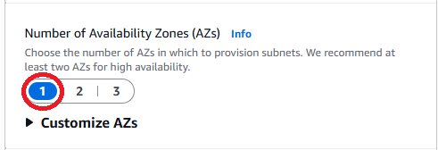

# Testing-VPC-Connectivity...... 

## A complete step by step guide to test VPC Connectivity

* Connect to your Public Server from AWS Mamangement Console

* Test connectivity between your EC2 instances
 
* Test VPC connectivity with the internet.

### This project will demostrate how to 

* Set up a VPC & Network ACL

* Create an EC2 Instance and .......

#### Step by Step Instructions guidance

**CREATE VPC & NETWORK ACL**

* Search and Select VPC from AWS Searchbar

  
    

  
* Select Create VPC

  
    

  
* Select VPC and more

  
    

  
* Give an specfic name in the auto-generation box.

  
    

  
* Scroll down and change the availibility zone number to one.

  
    

  
* Scroll down and click on arrow for Customize subnets CIDR blocks and input the ip addresses displayed in the two subnet boxes.

  
    

  
* Scroll down to where it says NAT Gateways and select the option for none.

  
    

  
* Select Create VPC at bottom.

  
    

  
* Select Network ACLs from the left hand navigation panel.

  
    

  
* Select the Create network ACL on the top right

  
    

  
* Give your ACL a name

  
    

  
* Select the earlier created VPC

  
    

  
* Select Create Network ACL at the bottom.

  
    

  
* Select the Subnet Asscociations tab

  
    

  
* Select Edit Subnet Asscociations

  
    

  
* Select the private subnet

  
    

  
* Select Save Changes at bottom.

  
    

  
* Select Security Groups from the left hand navigation panel

  
    

  
* Select Create Security Group on the top right

  
    

  
* Give the Security Group a name.

  
    

  
* Give a decription for the Security Group

  
    

  
* Select the earlier created VPC

  
    

  
* Select add rule under Inbound rules

  
    

  
* Select HTTP and anywhere IPV4 as both the type and source for the Inbound Rule

  
    

  
* Select Create Security Group at the bottom.

  
    

  

**Create an EC2 Instance &....**

* Search and Select EC2 from AWS Searchbar

* Select Instances from the left hand navigation panel

* Select Launch Instances from top right

* Give your instance a name

* Select your Keypair

* Select Edit next to Network Settings.

##### Contribution Policy

This project is not accepting external contributions, including pull requests or feature requests.

It serves as a personal archive of my learning journey in applying foundational concepts in software development and version control. Active development is not ongoing, and external changes will not be integrated.

Thank you for your understanding.
